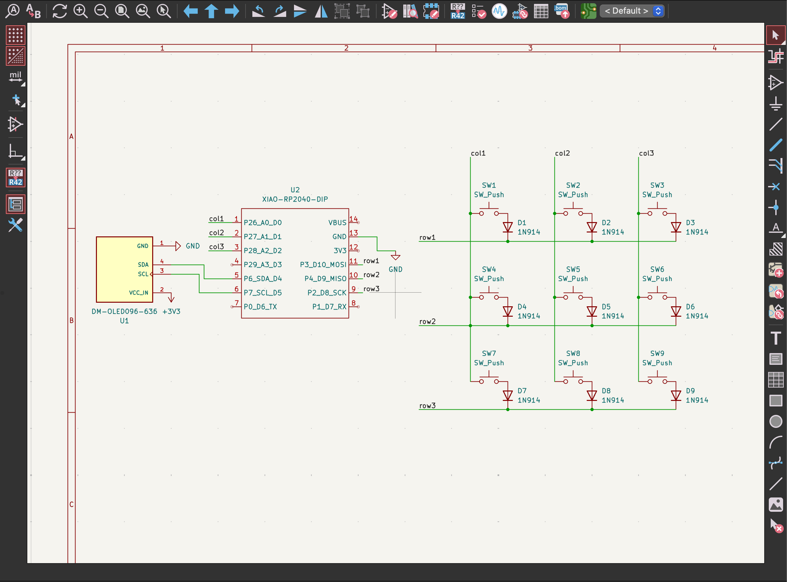
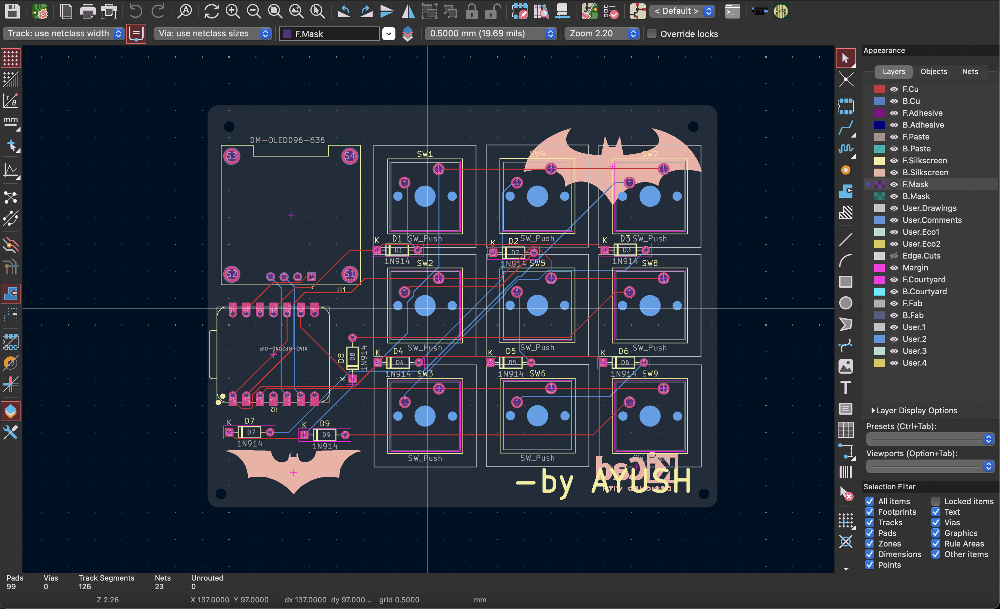
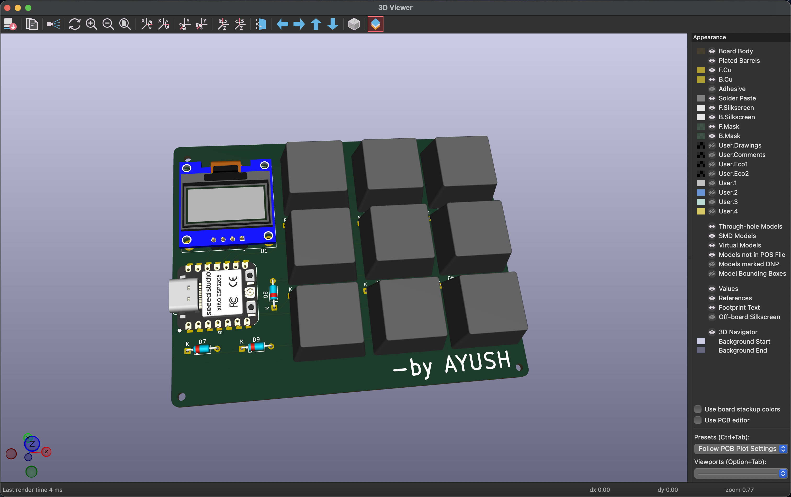
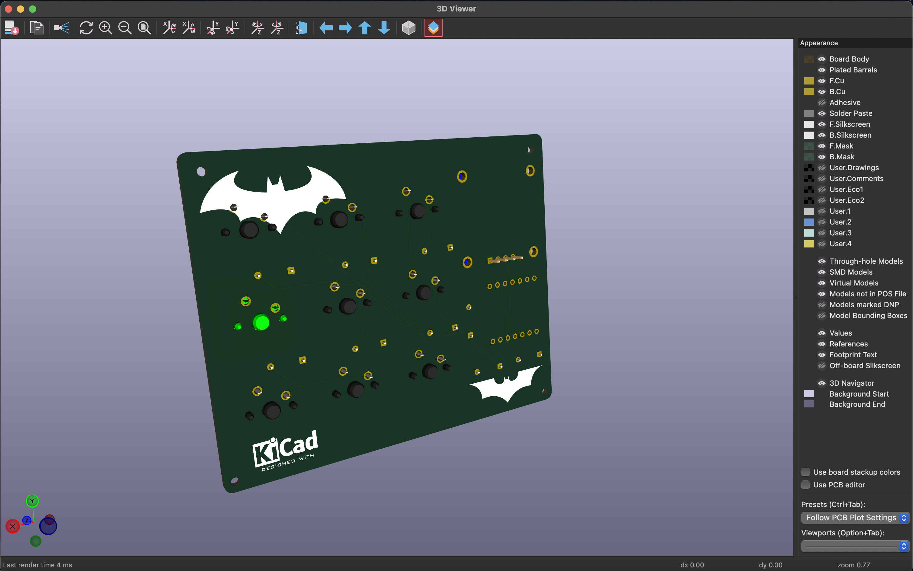
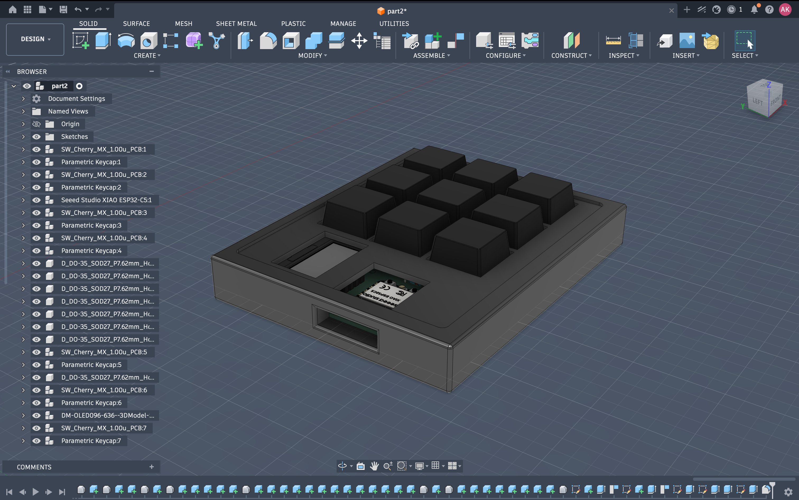
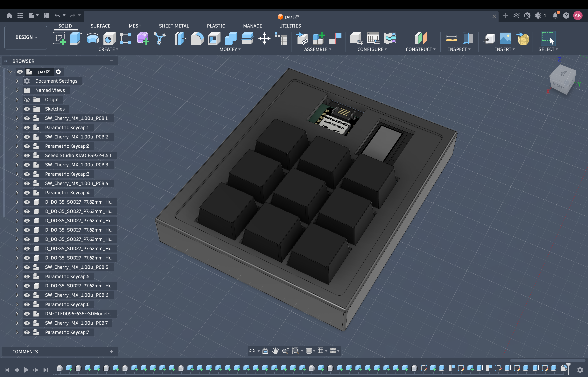

# Hackpad

Hi there! Here is my personal Hack Club macropad.

It is a compact 3x3 keyboard meant for shortcuts, programming and gaming.  
The keyboard consists of a Seeed XIAO RP2040 microcontroller, OLED screen, and mechanical switches.

## What it includes
- 3x3 mechanical switches
- 0.91" OLED screen
- Seeed XIAO RP2040
- 3D-printed housing
- Custom PCB designed in KiCad

## Images

### Schematic

### PCB Layout

### 3D Front View

### 3D Back View

### Render 1

### Render 2

## Bill of Materials (BOM)

| Name                                    | Purpose                                | Quantity | Reference Link                                                                                                                                                                                     | Distributor               |
| --------------------------------------- | -------------------------------------- | -------- | -------------------------------------------------------------------------------------------------------------------------------------------------------------------------------------------------- | ------------------------- |
| PCB                                     | Main board for soldering all the parts | 1        | Custom-designed PCB                                                                                                                                                                                | Custom Fabrication        |
| Seeed XIAO RP2040                       | Main controller                        | 1        | [https://robu.in/product/seeed-studio-xiao-rp2040-v1-0/](https://robu.in/product/seeed-studio-xiao-rp2040-v1-0/)                                                                                   | Robu.in                   |
| MX Switches                             | Mechanical switches for the 3×3 keypad | 9        | [https://keychron.in/product/cherry-mx-switch-set/](https://keychron.in/product/cherry-mx-switch-set/)                                                                                             | Keychron                  |
| Keycaps                                 | Keycaps mounted on the switches        | 9        | [https://meckeys.com/shop/accessories/keyboard-accessories/keycaps/cherry-colour-pbt-keycap-set/](https://meckeys.com/shop/accessories/keyboard-accessories/keycaps/cherry-colour-pbt-keycap-set/) | Meckeys                   |
| 1N4148 Diodes                           | Prevent ghosting in the key matrix     | 9        | [https://quartzcomponents.com/products/1n4148-zener-diode](https://quartzcomponents.com/products/1n4148-zener-diode)                                                                               | Quartz Components         |
| 0.91" OLED Display (128×32 I2C SSD1306) | Displays status and information        | 1        | [https://www.buydisplay.com/i2c-blue-0-91-inch-oled-display-module-128x32-arduino-raspberry-pi](https://www.buydisplay.com/i2c-blue-0-91-inch-oled-display-module-128x32-arduino-raspberry-pi)     | BuyDisplay                |
| 5 mm LED                                | Indicates device status / key presses  | 1        | [https://robu.in/product/5mm-red-led-pack-of-10/](https://robu.in/product/5mm-red-led-pack-of-10/)                                                                                                 | Robu.in                   |
| 220 Ω Resistor                          | Limits current through the LED         | 1        | [https://robocraze.com/products/220-ohm-resistor-pack-of-10](https://robocraze.com/products/220-ohm-resistor-pack-of-10)                                                                           | RoboCraze                 |
| 3D Printed Case                         | Encloses and protects the device       | 1        | Custom-designed and 3D printed                                                                                                                                                                     | Local 3D Printing Service |

## Project files structure
- `kicad/` - PCB files
- `cad/` - 3D models
- `grb/` - gerber files for manufacturing
- `image/` - screenshots and renders

## Parts list
- 9x MX-style switches
- 9x keycaps
- 1x Seeed XIAO RP2040
- 1x 0.91" OLED screen
- 9x diodes
- 1x custom PCB
- 1x 3D-printed housing

## Firmware
For firmware I used CircuitPython.

### Brief steps
1. Load CircuitPython on the XIAO RP2040
2. Move necessary libraries onto the board
3. Upload `code.py` file 
4. Connect and test the switches

## Images
The images with PCB and 3D render can be found in the `image/` folder.
